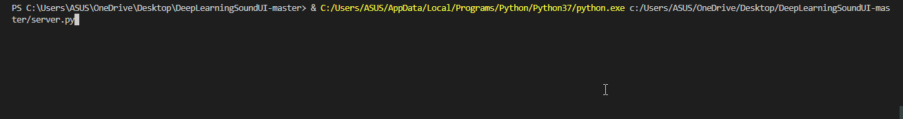
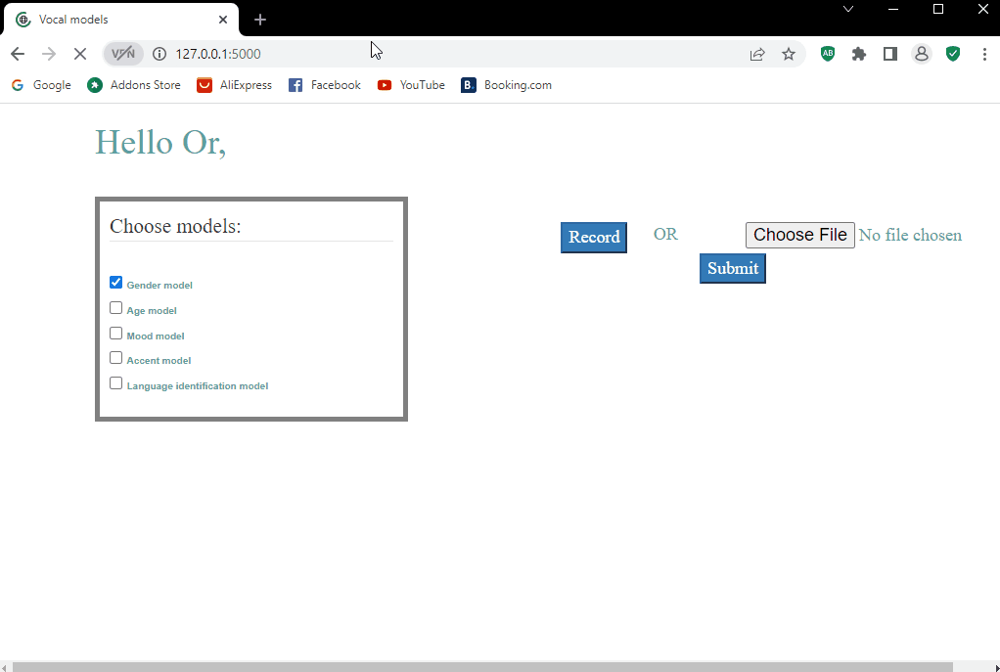

# Speech Models Website

## About The Project
This project was created by a group of students from Ariel University in the course Deep Learning Methods for NLP & Speech Analysis.
each pair of students had created a CNN model which can classify the audio.

## Github
- https://github.com/Orya-s/DeepLearningSound
- https://github.com/DorAzaria/Voice-Emotion-Recognition
- https://github.com/ortrsa/Voice-Accent-classification
- https://github.com/shlomog12/Spoken_language_identification

## Install
### Dependencies
- Platform:
  - OS: Linux or Windows
  - Version: Python 3.7.4+
- Python modules:
  - Flask
  - numpy
  - pandas
  - torch
  - torchaudio
  - pydub
- 3rd party tools:
  - ffmpeg (used by pydub the windows and linux have different installtion)
- HTML:
  - Javascript
  - CSS
  - Bootstrap
  - AJAX
## How To Use
Launch 'server.py' on root for relative paths to work.

### Example Of Server running


### Example Of Client Browser
In this example the user selects all the models and audio file to send to the server

## Directory Structure
```
└── project/              # Project's root directory.
    ├── model/            # trained models and code to use them.
    ├── static/           # images and css of the HTML
    ├── templates/        # HTML of website.
    └── train_scripts/    # code of the model for training.
```

